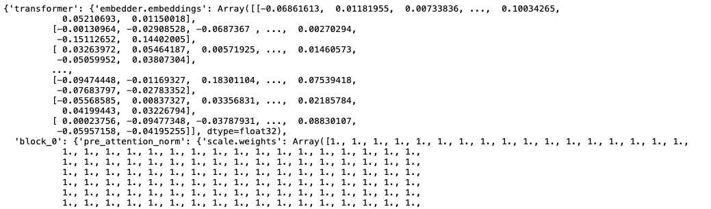
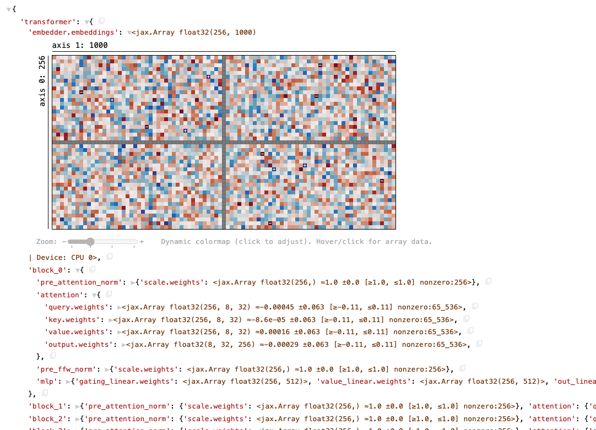

# Treescope

Treescope is an interactive HTML pretty-printer and N-dimensional array
("tensor") visualizer, designed for machine learning and neural networks
research in IPython notebooks. It's a drop-in replacement for the standard
IPython/Colab renderer, and adds support for:

* Expanding and collapsing subtrees of rendered objects, to let you focus on
  the parts of your model that you care about,
* Automatically embedding faceted visualizations of arbitrary-dimensional arrays
  and tensors directly into the output renderings, so you can quickly understand
  their shapes and the distribution of their values,
* Color-coding parts of neural network models to emphasize shared structures,
* Inserting "copy path" buttons that let you easily copy the path to any part of
  a rendered object,
* Customizing the visualization strategy to support rendering your own data
  structures,
* And more!

Treescope was originally developed as the pretty-printer for the
[Penzai neural network library](https://penzai.readthedocs.io/en/stable), but
it also supports rendering neural networks developed with other libraries,
including
[Equinox](https://docs.kidger.site/equinox/),
[Flax NNX](https://flax.readthedocs.io/en/latest/nnx/index.html),
and
[PyTorch](https://pytorch.org/docs/stable/).
You can also use it with basic
[JAX](https://jax.readthedocs.io/en/latest/)
and
[Numpy](https://numpy.org/doc/stable/)
code.


With Treescope, instead of looking at this:



You could be looking at this:



This is an interactive visualization; try clicking the `▶` buttons to expand
parts of the output! (You can also hold shift while scrolling to
scroll horizontally instead of vertically.)

Documentation on Treescope can be found at
[https://treescope.readthedocs.io](https://treescope.readthedocs.io).


## Getting Started

You can install Treescope using:

```bash
pip install treescope
```

and import it using:

```python
import treescope
```

To render a specific object in an IPython notebook with Treescope, you can use
`treescope.show`, which is like `print` but produces a rich interactive output.

Alternatively, you can simply configure Treescope as the default pretty printer
for your notebook via:

```python
treescope.register_as_default()
```

To turn on automatic array visualization, you can run:

```python
treescope.active_autovisualizer.set_globally(treescope.ArrayAutovisualizer())
```

Or, if you'd like to both set up Treescope as the default pretty printer and
enable automatic array visualization, you can simply run:

```python
treescope.basic_interactive_setup(autovisualize_arrays=True)
```

Once you've rendered an object, try clicking on it and pressing the `r` key!
This turns on "roundtrip mode", and adds qualified names to every type in the
visualization, making it easier to identify what the types in your object are.

For more information on how to use Treescope, check out the [Treescope documentation](https://treescope.readthedocs.io).

Looking for a neural network library with first-class support for Treescope's
visualization features?
Try [Penzai](https://penzai.readthedocs.io/en/stable)!

## Citation

If you have found Treescope to be useful for your research, please consider
citing the following writeup (also available on [arXiv](https://arxiv.org/abs/2408.00211)):

```
@article{johnson2024penzai,
    author={Daniel D. Johnson},
    title={{Penzai} + {Treescope}: A Toolkit for Interpreting, Visualizing, and Editing Models As Data},
    year={2024},
    journal={ICML 2024 Workshop on Mechanistic Interpretability}
}
```

---

*This is not an officially supported Google product.*
